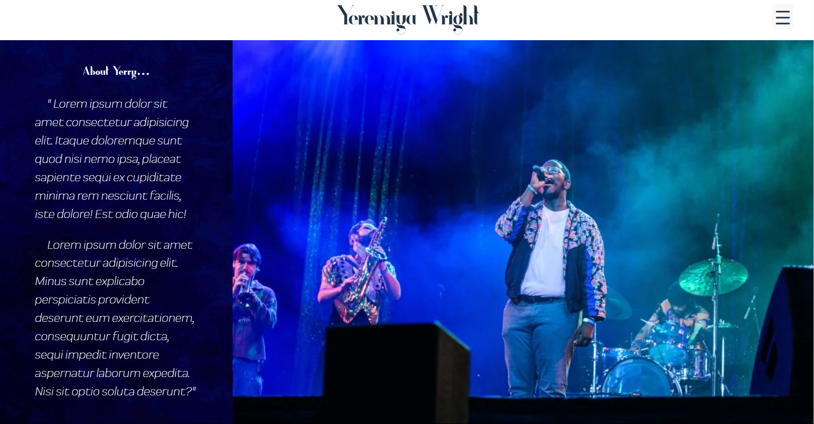

# Yeremiya Wright Vocalist Showcase

This is a professional page for a singer who specializes in jazz.
It is for recruiters, talent agents, and directors to contact him
as well as to see his showcased talent.

### Live Website:
[yerrywright.netlify.app](https://yerrywright.netlify.app)

## Content:
- Slideshow of a few photos of the client at the front of the website.
- An 'about me' section that also lists accomplishments, education, gigs
and shows the vocalist has sung for.
- A section to view footage of client's performances handpicked by the client and
embedded in iframes from Google Drive.
- A link to download three different resumes (Teaching, corporate, performance). Users
can choose to only download the resume they need for hiring or contracting client. 
- A contact form that takes user's name, email address, and message, then sends that
information to formSubmit.co, and online backend service for handling form data and 
emailing it to users. This is to protect the client's email address.
- A sidebar which scrolls to the corresponding section clicked.

## Note:
At the time of writing, the client is still in the progress of gathering his resume
files and writing a few paragraphs for his biography. This is why the biography section uses
temporary dummy text Lorem Ipsum. This is also why the resume buttons don't do anything yet.
Once I receive the content, those buttons will allow users to download PDF files of the chosen
resume.

### Technology used:
- VSCode
- React JS
- Fetch
- Javascript
- CSS
- HTML
- Git